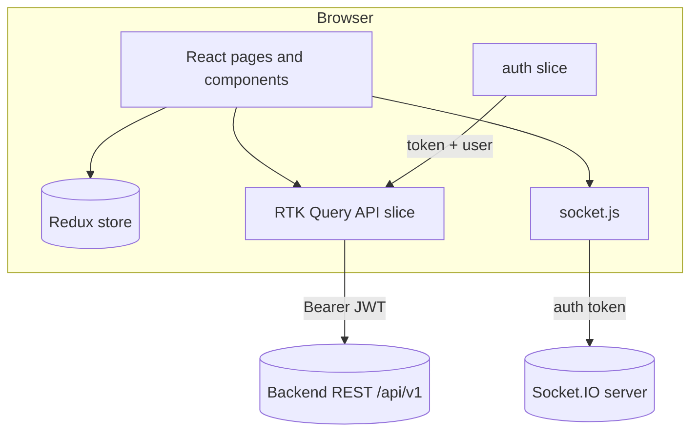

# EBA Observa — IoT & M&E Dashboard (Frontend)

Single-page application for **environmental monitoring and evaluation (M&E)**: authenticated operators manage sensor streams, reports, alerts, device sampling, notifications, and content. Public routes cover marketing, blog, and support contact. The UI targets **React 19**, **Vite 8**, **Redux Toolkit + RTK Query**, **Tailwind CSS v4**, and **Socket.IO** for optional live updates.

---

## Table of contents

1. [Architecture](#architecture)
2. [Tech stack](#tech-stack)
3. [Repository layout](#repository-layout)
4. [Prerequisites](#prerequisites)
5. [Environment variables](#environment-variables)
6. [Scripts](#scripts)
7. [Application bootstrap](#application-bootstrap)
8. [Routing](#routing)
9. [Authentication & session](#authentication--session)
10. [Authorization (RBAC)](#authorization-rbac)
11. [Data layer (RTK Query)](#data-layer-rtk-query)
12. [Real-time (Socket.IO)](#real-time-socketio)
13. [Theming](#theming)
14. [Styling & design tokens](#styling--design-tokens)
15. [Build & deployment](#build--deployment)
16. [Quality gates](#quality-gates)
17. [Security notes](#security-notes)
18. [Extending the codebase](#extending-the-codebase)

---

## Architecture

High-level data flow: **UI → RTK Query / Redux → REST API**; **Dashboard** optionally opens a **Socket.IO** session for push-style updates when enabled.



---

## Tech stack

| Layer | Choice |
|--------|--------|
| Runtime | React 19 |
| Bundler / dev server | Vite 8 (`@vitejs/plugin-react`) |
| Routing | React Router 7 |
| Global state | Redux Toolkit (`configureStore`) |
| Server state / caching | RTK Query (`createApi`, `fetchBaseQuery`) |
| HTTP | `fetch` via RTK Query |
| Real-time | `socket.io-client` (optional, env-gated) |
| Styling | Tailwind CSS v4 (`@import "tailwindcss"`, `@tailwindcss/vite`) |
| Charts | Chart.js + `react-chartjs-2`, Recharts (where used) |
| Motion | Framer Motion |
| Icons | Lucide React |
| Feedback | `react-toastify` |
| Dates | `date-fns`, `react-datepicker` |

---

## Repository layout

| Path | Role |
|------|------|
| `src/main.jsx` | `createRoot`, Redux `Provider`, `BrowserRouter`, `ToastContainer` |
| `src/App.jsx` | `ThemeProvider`, route tree (public + protected + dashboard shell) |
| `src/store/index.js` | Redux store: `api` reducer + `auth` slice + RTK Query middleware |
| `src/services/api/index.js` | **Single RTK Query API definition**: endpoints, tags, exported hooks |
| `src/services/reducers/authReducer.js` | JWT + user persistence for `prepareHeaders` |
| `src/services/socket.js` | Socket.IO client factory, reconnect and env toggles |
| `src/context/ThemeContext.jsx` | `system` / `light` / `dark`, `localStorage`, `document.documentElement` class |
| `src/components/Dashboard.jsx` | Shell: sidebar, top bar, notifications, `Outlet` |
| `src/components/ProtectedRoutes.jsx` | Auth gate + inactive account redirect |
| `src/components/RequireStaffInsights.jsx` | Role gate for reports / alerts / notifications |
| `src/hooks/usePermissions.js` | Memoized role capabilities for UI |
| `src/utils/roles.js` | Canonical role checks (`admin`, `manager`, `user`) |
| `src/pages/dashboard/*` | Authenticated feature modules |
| `src/pages/dashboard/admin/*` | Admin / staff tools |
| `src/pages/*.jsx` | Public marketing, blog, support |
| `src/components/common/*` | Shared UI (pagination, filters, theme selector, etc.) |
| `src/index.css` | Tailwind entry + `@theme` design tokens (`eco`, `ocean`, `teal`, semantic) |

---

## Prerequisites

- **Node.js** LTS (compatible with Vite 8; use current LTS unless the team pins otherwise).
- A running **backend** exposing the REST API (default base URL below) and optionally Socket.IO.

---

## Environment variables

Vite exposes only variables prefixed with **`VITE_`**. Define them in `.env` or `.env.local` (not committed if secrets).

| Variable | Purpose | Default / behavior |
|----------|---------|---------------------|
| `VITE_API_URL` | REST API base (should include `/api/v1` if that is your server prefix) | `http://localhost:3000/api/v1` |
| `VITE_SOCKET_URL` | Socket.IO origin (often same host as API without path) | `http://localhost:3000` |
| `VITE_ENABLE_SOCKET` | Set to `0`, `false`, or `off` to **disable** all Socket.IO traffic | enabled when unset |
| `VITE_SOCKET_USE_WEBSOCKET` | Set to `1` to allow transport upgrade to WebSocket after polling | polling-only when unset |

Example `.env`:

```env
VITE_API_URL=http://localhost:3000/api/v1
VITE_SOCKET_URL=http://localhost:3000
VITE_ENABLE_SOCKET=1
VITE_SOCKET_USE_WEBSOCKET=0
```

---

## Scripts

| Command | Description |
|---------|-------------|
| `npm run dev` | Vite dev server (HMR) |
| `npm run build` | Production bundle to `dist/` |
| `npm run preview` | Serve `dist/` locally |
| `npm run lint` | ESLint across the project |

---

## Application bootstrap

1. **`main.jsx`** wraps the tree in **`Provider`** (Redux) and **`BrowserRouter`**, registers **`ToastContainer`**, then renders **`App`**.
2. **`App.jsx`** wraps routes in **`ThemeProvider`** so class-based dark mode applies before paint on navigations.
3. **`ProtectedRoutes`** renders **`Outlet`** only when `auth.token` and `auth.user` exist and `user.isActive !== false`.

---

## Routing

| Path | Access | Notes |
|------|--------|--------|
| `/` | Public | Landing |
| `/login`, `/verify`, `/account-inactive` | Public | OTP auth flow |
| `/blog`, `/blog/:slug` | Public | Content |
| `/support` | Public | Contact submission |
| `/dashboard` | Authenticated | Default child: **Overview** |
| `/dashboard/sensors`, `analytics`, `control`, `settings` | Authenticated | Control: **admin-only** (see RBAC) |
| `/dashboard/reports`, `alerts`, `notifications` | Staff | Wrapped in **`RequireStaffInsights`** |
| `/dashboard/admin/messages`, `blog`, `users` | Authenticated | UI should align with **`usePermissions`**; user management is **admin-only** |

Nested **`Dashboard`** layout hosts **`Outlet`** for all `/dashboard/*` children.

---

## Authentication & session

- **Login** posts credentials; backend typically returns a challenge requiring **OTP verification** on `/verify`.
- **JWT** is stored in the **auth slice** (and persisted as implemented in `authReducer`); RTK Query **`prepareHeaders`** attaches `Authorization: Bearer <token>`.
- **Logout** calls the API and clears client session state.
- **`getCurrentUser`** (`/auth/me`) hydrates or refreshes the user profile and supports tag **`User`** for cache coherence after profile updates.

---

## Authorization (RBAC)

Logic is centralized in **`src/utils/roles.js`** and exposed to components via **`usePermissions`**.

| Role | Typical capabilities |
|------|----------------------|
| **`user`** | View-only dashboard (no reports / alerts / notifications module access as wired) |
| **`manager`** | Insights: reports, alerts, notifications; content admin (blog, contact); **no** device control |
| **`admin`** | Full device control, user management, and other elevated routes |

**`RequireStaffInsights`** restricts routes to roles that pass **`canAccessReportsAlertsNotifications`**. **`canAccessDeviceControl`** is **admin-only**. Adjust **`roles.js`** and route wrappers together when the backend contract changes.

---

## Data layer (RTK Query)

- **Single API slice** in `src/services/api/index.js` with **`reducerPath: 'api'`**.
- **`fetchBaseQuery`** uses **`VITE_API_URL`** and injects the Bearer token from Redux.
- **`tagTypes`**: `Sensor`, `Report`, `Alert`, `Notification`, `Device`, `Blog`, `Research`, `Contact`, `User` — use **`providesTags`** / **`invalidatesTags`** when adding endpoints to avoid stale UI.
- Many endpoints use **`transformResponse`** to normalize `{ data }` vs raw payloads from the backend.

Research-related hooks are **exported** from the same module for parity with planned or external modules; wire **`endpoints`** in the same file when the backend routes are finalized.

---

## Real-time (Socket.IO)

**`src/services/socket.js`**:

- **`connectSocket(token)`** — creates client with `auth: { token }`, reconnection limits, and optional WebSocket upgrade controlled by **`VITE_SOCKET_USE_WEBSOCKET`**.
- **`VITE_ENABLE_SOCKET`** — hard off switch for environments without a socket server (avoids console noise).
- **`disconnectSocket`** — used on logout / unmount patterns in the dashboard shell.

---

## Theming

**`ThemeContext`** persists **`colorMode`** (`system` | `light` | `dark`) under **`colorMode`** in `localStorage`, migrates legacy `theme` key, listens to **`prefers-color-scheme`** when in system mode, and toggles the **`dark`** class on **`document.documentElement`**.

**`ThemeModeSelector`** (and compact **`ThemeToggleButton`**) render the dropdown; dashboard chrome may omit the control where **Settings → Appearance** owns the same behavior.

---

## Styling & design tokens

**`src/index.css`**:

- **`@import "tailwindcss"`** and **`@tailwindcss/vite`** plugin in Vite.
- **`@custom-variant dark (&:where(.dark, .dark *));`** — dark styles apply under `.dark` on the root.
- **`@theme { ... }`** defines **brand palettes** (`eco-*`, `ocean-*`, `teal-*`), semantic **`alert-*` / `warn-*`**, and **font family**. Prefer these tokens over ad hoc hex values for product consistency.

---

## Build & deployment

1. Set production **`VITE_*`** values to your API and socket origins (HTTPS in production).
2. Run **`npm run build`** — output in **`dist/`**.
3. Serve **`dist/`** with any static host (nginx, S3 + CloudFront, Azure Static Web Apps, etc.).
4. Configure the host for **SPA fallback** (all routes → `index.html`) so client-side routing works.

---

## Quality gates

- **`npm run lint`** — ESLint 9 flat config (`eslint.config.js`).
- Keep **RTK Query** hooks and components free of `any` where possible; match existing JSDoc typedefs (e.g. theme context).

---

## Security notes

- Treat JWT as **secret in memory**; prefer **httpOnly cookies** if the backend moves to that model (would require RTK Query / `fetch` credential changes).
- **`rel="noopener noreferrer"`** on external links is already used where applicable.
- Socket auth uses the same token; **rotate** and **invalidate** on logout server-side for defense in depth.

---

## Extending the codebase

1. **New authenticated page** — Add route under **`Dashboard`** in `App.jsx`, add nav entry in **`Dashboard.jsx`**, create page under **`src/pages/dashboard/`**.
2. **New API surface** — Add **`builder.query` / `builder.mutation`** in **`services/api/index.js`**, export hooks at the bottom, use **`providesTags` / `invalidatesTags`**.
3. **New role rule** — Add helper in **`utils/roles.js`**, consume via **`usePermissions`**, mirror with a **`Require*`** wrapper if route-level enforcement is needed.
4. **New design token** — Extend **`@theme`** in **`index.css`**, then use **`bg-eco-*`**, **`text-ocean-*`**, etc., in components.

---

## License

Private project (`"private": true` in `package.json`). Add an explicit **LICENSE** file if you open-source or distribute the work.
